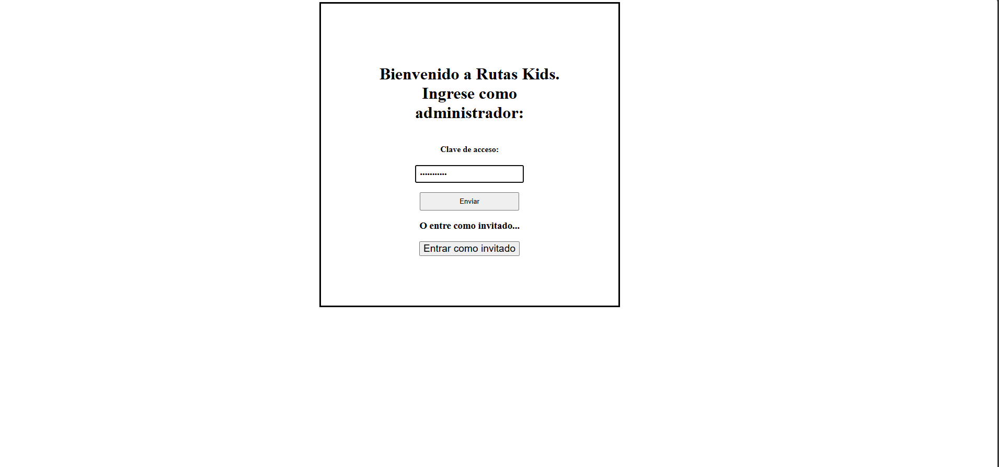
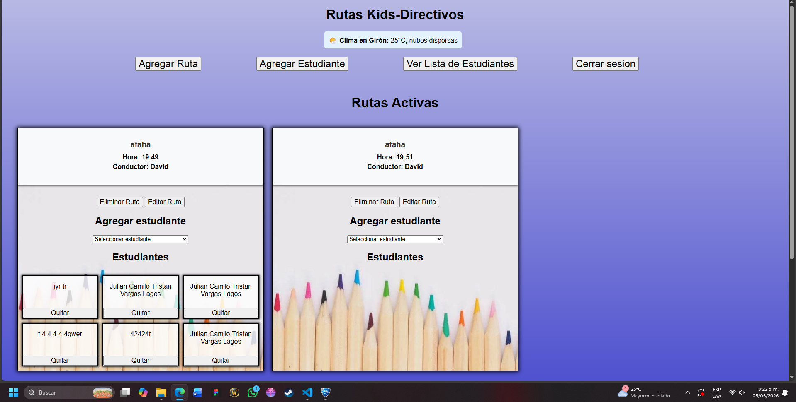
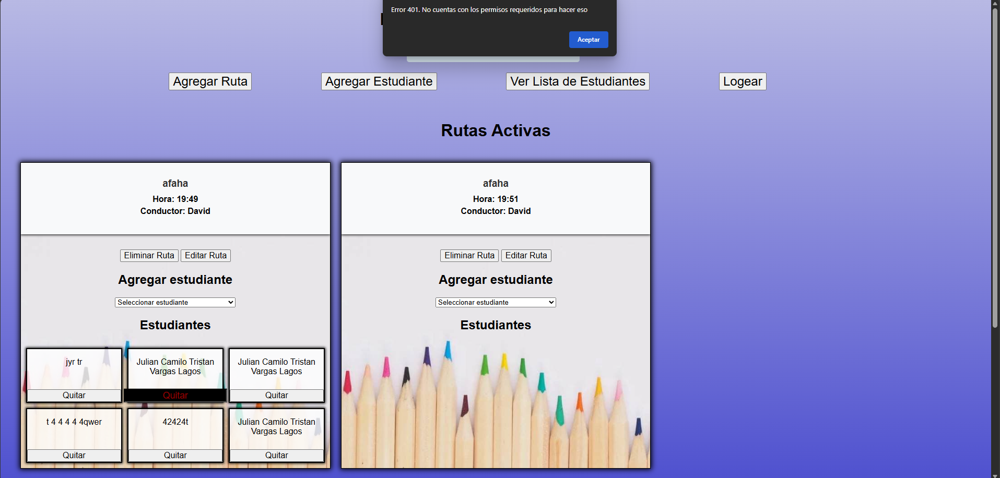

# Rutas Kids 🚌👧👦

**Rutas Kids** es una aplicación web interactiva y responsiva diseñada para optimizar y gestionar el transporte escolar de una institución educativa. El sistema cuenta con dos niveles de acceso diferenciados para mantener la seguridad y la integridad de los datos de los estudiantes.

---

## 📸 Capturas de Pantalla

### 1. Pantalla de Login (Acceso de Administrador)



### 2. Panel de Control Completo (Vista Directivo)



### 3. Restricción de Permisos (Vista Invitado/Padre de Familia)



---

## 🔐 Roles y Modos de Acceso

El sistema se divide en dos flujos lógicos controlados por archivos JavaScript independientes:

### 1. Perfil Directivo (Administrador)
* **Acceso:** Controlado mediante clave en la página de logeo (`indexLog.html`).
* **Capacidades CRUD Totales:** * Crear, editar y eliminar rutas escolares.
    * Registrar nuevos estudiantes y modificar sus datos personales (grado, dirección, acudiente, teléfono).
    * Asignar y desasignar de manera dinámica asientos libres dentro de los transportes activos.

### 2. Perfil Padres / Visitantes (Invitado)
* **Acceso:** Libre y sin credenciales.
* **Seguridad:** Permite la visualización pasiva de las rutas activas, el conductor asignado y los horarios.
* **Protección de datos (Error 401):** Cualquier intento de agregar alumnos, alterar las rutas o consultar la base de datos completa de estudiantes bloqueará la acción mediante ventanas emergentes y modales informativos de falta de permisos.

---

## ✨ Características Técnicas Destacadas

* **Web Components Nativos:** Creación de la etiqueta `<route-card>` mediante *Shadow DOM* para encapsular el diseño y la renderización limpia de la cabecera de las rutas (Nombre, conductor y hora).
* **Persistencia Local (`localStorage`):** Los cambios realizados por los administradores se guardan de forma inmediata en el navegador, sincronizando las consultas de los invitados en tiempo real.
* **Consumo de API Asíncrona (`async/await`):** Integración con la API de *OpenWeatherMap* para desplegar dinámicamente el estado meteorológico actual de la localidad de Girón, Santander.
* **Diseño 100% Responsivo:** Adaptado meticulosamente mediante *Media Queries* en CSS para pantallas de Escritorio, Tabletas, Celulares y pantallas de escala ultra pequeña.

---

## 🛠️ Tecnologías Utilizadas

* **HTML5:** Estructura semántica multivisual.
* **CSS3:** Estilos avanzados, cuadrículas dinámicas (*CSS Grid*), cajas alineadas (*Flexbox*) y animaciones adaptativas.
* **JavaScript (Vanilla JS):** Arquitectura modular dividida para control de login (`appLog.js`), comportamiento del administrador (`app.js`) y restricciones de invitado (`appV.js`).
* **OpenWeatherMap API:** Servicio meteorológico externo.

---

## 🚀 Instalación y Uso Local

1.  **Clona este repositorio:**
    ```bash
    git clone [https://github.com/goldensunjulian/Rutas-Kids.git](https://github.com/goldensunjulian/Rutas-Kids.git)
    ```
2.  **Navega al directorio del proyecto:**
    ```bash
    cd rutas-kids
    ```
3.  **Ejecución:**
    * Inicia la aplicación abriendo el archivo de acceso principal `indexLog.html`.
    * Para pruebas de administración, utiliza la clave preestablecida en el código fuente.

---

## 🧑‍💻 Autor

Desarrollado por:
* **Julián Camilo Tristán Vargas Lagos**
* 📩 [Contacto vía Gmail](https://mail.google.com/mail/?view=cm&fs=1&to=tristanlagos2025@gmail.com&su=Asunto+del+Mensaje)

---
<p align="center">Copyright © 2026 Rutas Kids. Todos los derechos reservados.</p>